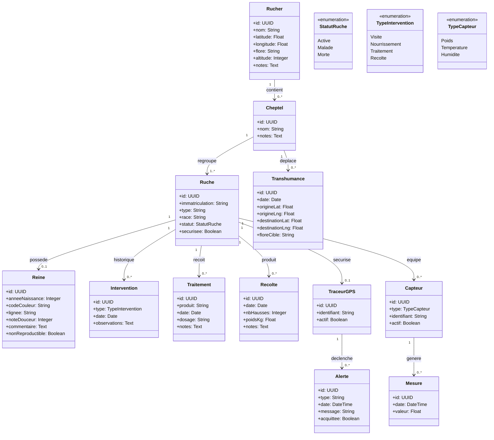

```mermaid
classDiagram
 
%% =========================
%% Organisation & Structure
%% =========================
 
class Rucher {
  +id: UUID
  +nom: String
  +latitude: Float
  +longitude: Float
  +flore: String
  +altitude: Integer
  +notes: Text
}
 
class Cheptel {
  +id: UUID
  +nom: String
  +notes: Text
}
 
class Ruche {
  +id: UUID
  +immatriculation: String
  +type: String
  +race: String
  +statut: StatutRuche
  +securisee: Boolean
}
 
class Reine {
  +id: UUID
  +anneeNaissance: Integer
  +codeCouleur: String
  +lignee: String
  +noteDouceur: Integer
  +commentaire: Text
  +nonReproductible: Boolean
}
 
%% =========================
%% Suivi & Interventions
%% =========================
 
class Intervention {
  +id: UUID
  +type: TypeIntervention
  +date: Date
  +observations: Text
}
 
class Traitement {
  +id: UUID
  +produit: String
  +date: Date
  +dosage: String
  +notes: Text
}
 
class Recolte {
  +id: UUID
  +date: Date
  +nbHausses: Integer
  +poidsKg: Float
  +notes: Text
}
 
%% =========================
%% Transhumance & Sécurité
%% =========================
 
class Transhumance {
  +id: UUID
  +date: Date
  +origineLat: Float
  +origineLng: Float
  +destinationLat: Float
  +destinationLng: Float
  +floreCible: String
}
 
class TraceurGPS {
  +id: UUID
  +identifiant: String
  +actif: Boolean
}
 
class Alerte {
  +id: UUID
  +type: String
  +date: DateTime
  +message: String
  +acquittee: Boolean
}
 
%% =========================
%% IoT Monitoring
%% =========================
 
class Capteur {
  +id: UUID
  +type: TypeCapteur
  +identifiant: String
  +actif: Boolean
}
 
class Mesure {
  +id: UUID
  +date: DateTime
  +valeur: Float
}
 
%% =========================
%% Relations
%% =========================
 
Rucher "1" --> "0..*" Cheptel : contient
Cheptel "1" --> "1..*" Ruche : regroupe
 
Ruche "1" --> "0..1" Reine : possede
Ruche "1" --> "0..*" Intervention : historique
Ruche "1" --> "0..*" Recolte : produit
Ruche "1" --> "0..*" Traitement : recoit
 
Cheptel "1" --> "0..*" Transhumance : deplace
 
Ruche "1" --> "0..1" TraceurGPS : securise
TraceurGPS "1" --> "0..*" Alerte : declenche
 
Ruche "1" --> "0..*" Capteur : equipe
Capteur "1" --> "0..*" Mesure : genere
 
%% =========================
%% Enums
%% =========================
 
class StatutRuche {
  <<enumeration>>
  Active
  Malade
  Morte
}
 
class TypeIntervention {
  <<enumeration>>
  Visite
  Nourrissement
  Traitement
  Recolte
}
 
class TypeCapteur {
  <<enumeration>>
  Poids
  Temperature
  Humidite
}
 
```