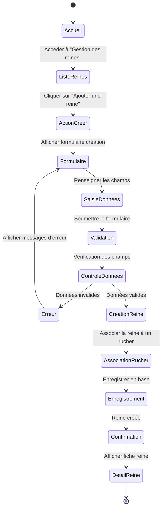

```mermaid
stateDiagram-v2
    [*] --> Accueil

    Accueil --> ListeReines : Accéder à "Gestion des reines"
    ListeReines --> ActionCreer : Cliquer sur "Ajouter une reine"

    ActionCreer --> Formulaire : Afficher formulaire création

    Formulaire --> SaisieDonnees : Renseigner les champs
    SaisieDonnees --> Validation : Soumettre le formulaire

    Validation --> ControleDonnees : Vérification des champs

    ControleDonnees --> Erreur : Données invalides
    Erreur --> Formulaire : Afficher messages d’erreur

    ControleDonnees --> CreationReine : Données valides
    CreationReine --> AssociationRucher : Associer la reine à un rucher
    AssociationRucher --> Enregistrement : Enregistrer en base

    Enregistrement --> Confirmation : Reine créée
    Confirmation --> DetailReine : Afficher fiche reine

    DetailReine --> [*]
```
