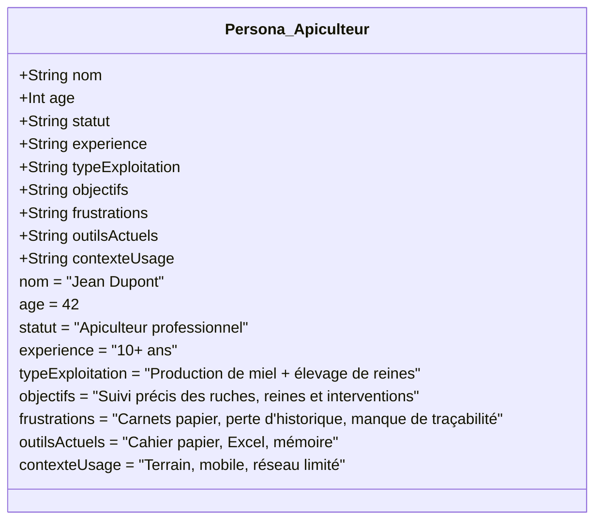

```mermaid
classDiagram
    class Persona_Apiculteur {
        +String nom
        +Int age
        +String statut
        +String experience
        +String typeExploitation
        +String objectifs
        +String frustrations
        +String outilsActuels
        +String contexteUsage
    }

    Persona_Apiculteur : nom = "Jean Dupont"
    Persona_Apiculteur : age = 42
    Persona_Apiculteur : statut = "Apiculteur professionnel"
    Persona_Apiculteur : experience = "10+ ans"
    Persona_Apiculteur : typeExploitation = "Production de miel + élevage de reines"
    Persona_Apiculteur : objectifs = "Suivi précis des ruches, reines et interventions"
    Persona_Apiculteur : frustrations = "Carnets papier, perte d'historique, manque de traçabilité"
    Persona_Apiculteur : outilsActuels = "Cahier papier, Excel, mémoire"
    Persona_Apiculteur : contexteUsage = "Terrain, mobile, réseau limité"
```
