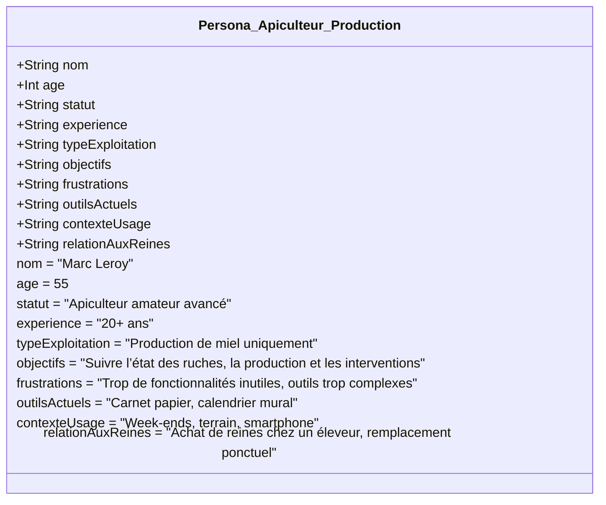

```mermaid
classDiagram
    class Persona_Apiculteur_Production {
        +String nom
        +Int age
        +String statut
        +String experience
        +String typeExploitation
        +String objectifs
        +String frustrations
        +String outilsActuels
        +String contexteUsage
        +String relationAuxReines
    }

    Persona_Apiculteur_Production : nom = "Marc Leroy"
    Persona_Apiculteur_Production : age = 55
    Persona_Apiculteur_Production : statut = "Apiculteur amateur avancé"
    Persona_Apiculteur_Production : experience = "20+ ans"
    Persona_Apiculteur_Production : typeExploitation = "Production de miel uniquement"
    Persona_Apiculteur_Production : objectifs = "Suivre l’état des ruches, la production et les interventions"
    Persona_Apiculteur_Production : frustrations = "Trop de fonctionnalités inutiles, outils trop complexes"
    Persona_Apiculteur_Production : outilsActuels = "Carnet papier, calendrier mural"
    Persona_Apiculteur_Production : contexteUsage = "Week-ends, terrain, smartphone"
    Persona_Apiculteur_Production : relationAuxReines = "Achat de reines chez un éleveur, remplacement ponctuel"
```
