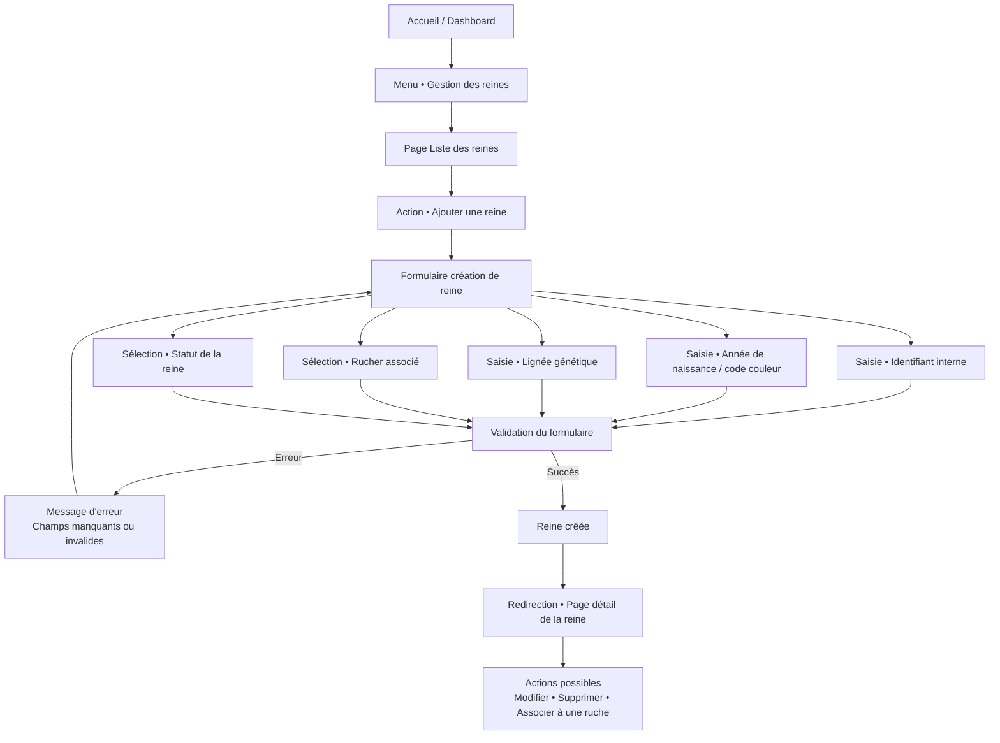

```mermaid
flowchart TD
    A[Accueil / Dashboard] --> B[Menu • Gestion des reines]

    B --> C[Page Liste des reines]

    C --> D[Action • Ajouter une reine]

    D --> E[Formulaire création de reine]

    E --> E1[Saisie • Identifiant interne]
    E --> E2[Saisie • Année de naissance / code couleur]
    E --> E3[Saisie • Lignée génétique]
    E --> E4[Sélection • Rucher associé]
    E --> E5[Sélection • Statut de la reine]

    E1 --> F[Validation du formulaire]
    E2 --> F
    E3 --> F
    E4 --> F
    E5 --> F

    F -->|Erreur| G[Message d'erreur<br/>Champs manquants ou invalides]
    G --> E

    F -->|Succès| H[Reine créée]

    H --> I[Redirection • Page détail de la reine]
    I --> J[Actions possibles<br/>Modifier • Supprimer • Associer à une ruche]
```
