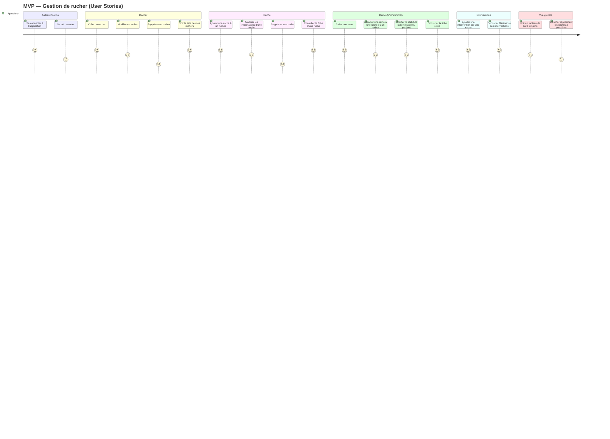

```mermaid
journey
    title MVP — Gestion de rucher (User Stories)

    section Authentification
      Se connecter à l’application: 5: Apiculteur
      Se déconnecter: 3: Apiculteur

    section Rucher
      Créer un rucher: 5: Apiculteur
      Modifier un rucher: 4: Apiculteur
      Supprimer un rucher: 2: Apiculteur
      Voir la liste de mes ruchers: 5: Apiculteur

    section Ruche
      Ajouter une ruche à un rucher: 5: Apiculteur
      Modifier les informations d’une ruche: 4: Apiculteur
      Supprimer une ruche: 2: Apiculteur
      Consulter la fiche d’une ruche: 5: Apiculteur

    section Reine (MVP minimal)
      Créer une reine: 5: Apiculteur
      Associer une reine à une ruche ou un rucher: 4: Apiculteur
      Modifier le statut de la reine (active / perdue): 4: Apiculteur
      Consulter la fiche reine: 5: Apiculteur

    section Interventions
      Ajouter une intervention sur une ruche: 5: Apiculteur
      Consulter l’historique des interventions: 5: Apiculteur

    section Vue globale
      Voir un tableau de bord simplifié: 4: Apiculteur
      Identifier rapidement les ruches à problème: 3: Apiculteur
```
